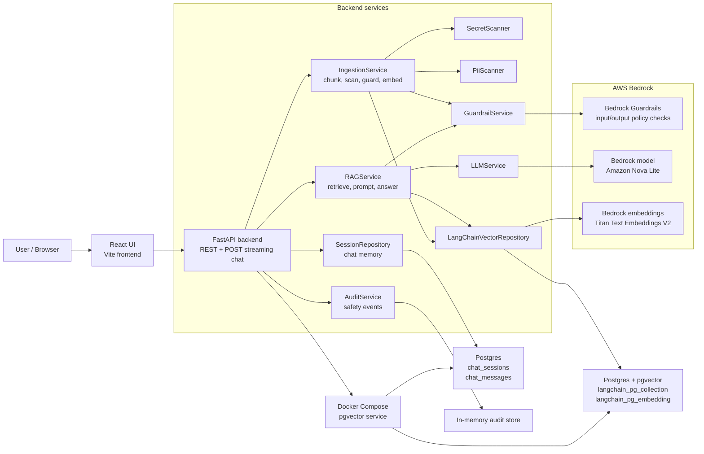
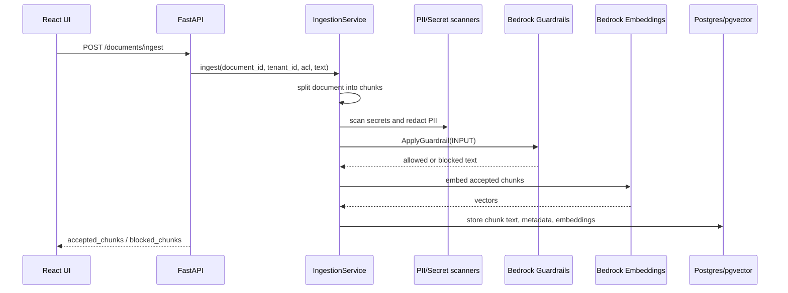
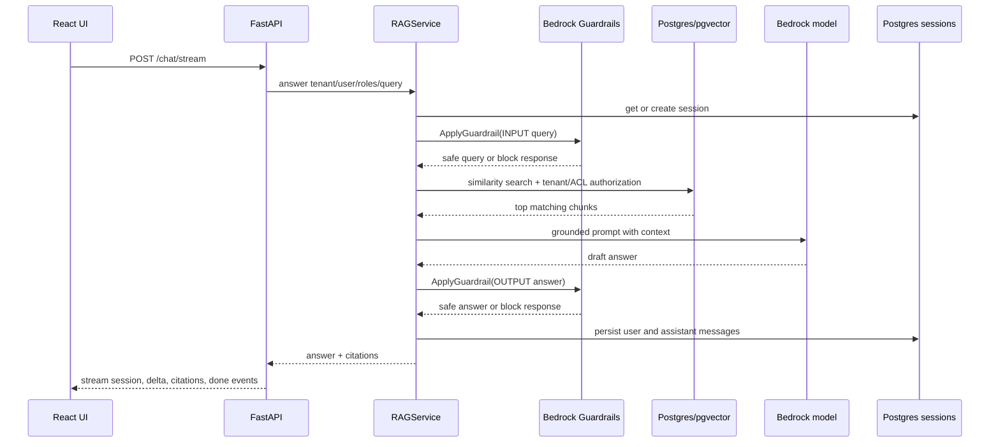

# SafeRAG Guardrails Platform HLD

## System Components

## Ingestion Flow

## Chat Flow

## Runtime Configuration

- `USE_BEDROCK=true` enables Bedrock Guardrails, embeddings, and chat model calls.
- `AWS_REGION=eu-north-1` selects the Bedrock region.
- `BEDROCK_GUARDRAIL_ID` and `BEDROCK_GUARDRAIL_VERSION` select the guardrail.
- `BEDROCK_MODEL_ID=amazon.nova-lite-v1:0` is used for answer generation.
- `BEDROCK_EMBEDDING_MODEL_ID=amazon.titan-embed-text-v2:0` is used for embeddings.
- `VECTOR_BACKEND=pgvector` stores document chunks and embeddings in Postgres/pgvector.
- `SESSION_BACKEND=postgres` stores chat sessions and messages in Postgres.
